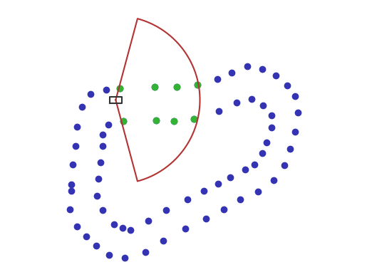

# Autonomous Formula Student Vehicle Path Planning

## Project Description
This Git repository contains the code and documentation for an autonomous path planning project developed by Oscar Eriksson and Borui Cui at KTH Formula Student. The primary focus of this project is to address the colorless path planning problem in an autonomous Formula Student Vehicle. The vehicle must navigate an unknown racetrack marked by blue and yellow cones, utilizing sensor data to estimate the track's path and make real-time adjustments.

### Screenshots

:---:
*Working environment*
*Fig. 1: Visible cones given pose*

## Estimation Problem
The core challenge lies in colorless path planning, where the vehicle must navigate a track consisting of blue cones on the left side and yellow cones on the right. The project aims to develop robust algorithms to handle color mislabeling and hallucinated cones, ensuring the vehicle accurately identifies the track even in challenging scenarios.

## Estimation Methods
The project explores two primary estimation methods:

1. **Grid-based Probability Assignment**: The LIDAR/camera system can detect cones within a 30m range with a 150° field of view. The area is discretized into a grid, with probabilities assigned to each tile corresponding to potential cone locations. A neural network processes this information, assigning probabilities to each tile's likelihood of being part of the track. Bayesian filtering is employed to incorporate successive estimations into a global grid, enhancing the robustness of the path estimation.

2. **Alternative Estimation Frameworks**: The project considers various estimation and filtering frameworks to generate a Maximum A Posteriori (MAP) estimate of the track. Successive measurements contribute to refining the track representation, ensuring adaptability to different scenarios and handling outliers effectively.

## Data Source
The Formula Student Competition guidelines provide specifications for track length, cone distances, and other relevant data. KTH Formula Student possesses a comprehensive suite for designing courses and abundant real-world LIDAR data recorded during vehicle operations. For training neural networks, simulated data with noise is generated, leveraging procedural methods to ensure diverse and feasible datasets.

## Contributors
- Oscar Eriksson
- Borui Cui

## Acknowledgments
We would like to express our gratitude to KTH Formula Student for their support and provision of resources for this project. Special thanks to the Formula Student Competition for establishing guidelines that facilitated the development of this autonomous path planning solution.
